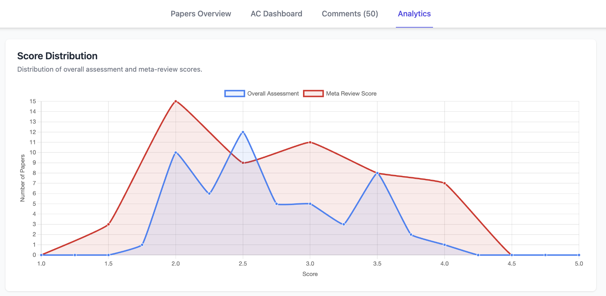
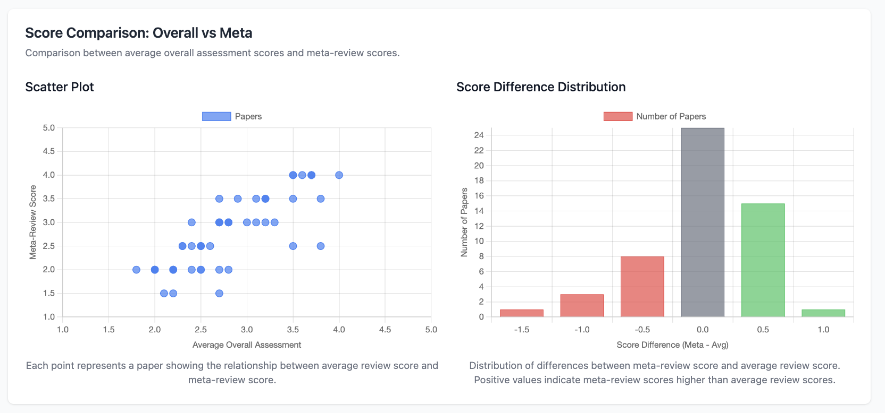
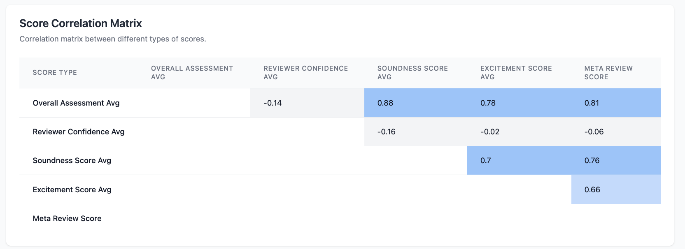
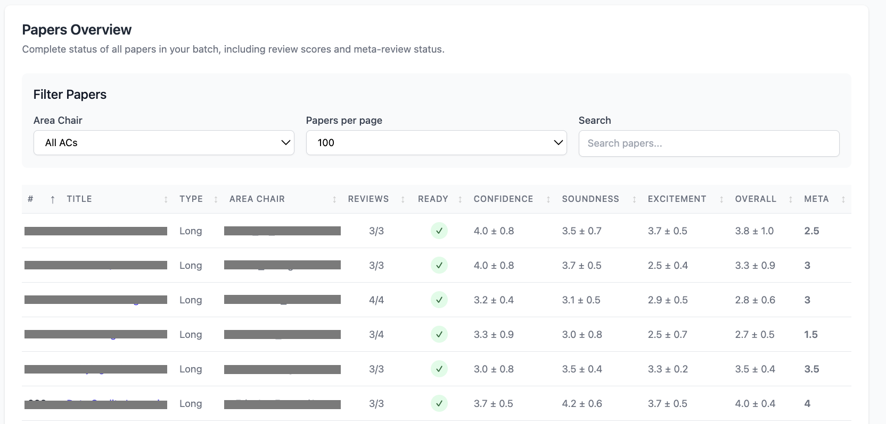
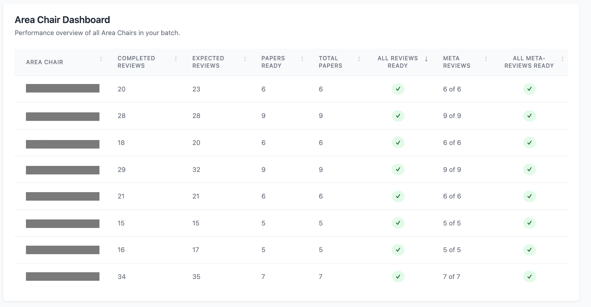
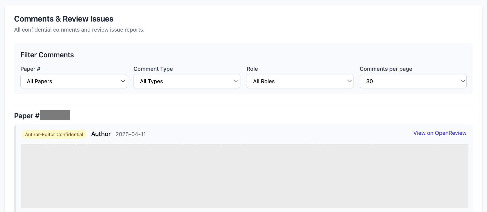

# ARR Report Generator

This tool generates beautiful, interactive HTML reports for reviewing ARR submissions using OpenReview data. 


## Screenshots

|  |  |  |
|-----------------|-----------------|-----------------|
|  |  |  |


## Installation

1. Clone this repository or download the source files:
   ```
   git clone <repository-url>
   cd arr-report-generator
   ```

2. Install required dependencies:
   ```
   pip install -r requirements.txt
   ```

## Usage

### Basic Usage

Run the script with your OpenReview credentials. The script will generate an HTML report in the `.reports/` directory. Just open the HTML file on your favorite browser.

**Review Phase:**

```bash
python generate_review_report.py --username "your_username" --password "your_password" --me "~Your_Name1" --venue_id "aclweb.org/ACL/ARR/2025/February"
```

Output in `./reports/review_report.html`. 


**Commitment Phase:**

```bash
python generate_commitment_report.py --username "your_username" --password "your_password" --me "~Your_Name1" --venue_id "aclweb.org/ACL/2025/Conference"
```

Output in `./reports/commitment_report.html`. 


**Command-line Arguments:**

- `--username`: Your OpenReview username (can also be set via `OPENREVIEW_USERNAME` environment variable)
- `--password`: Your OpenReview password (can also be set via `OPENREVIEW_PASSWORD` environment variable)
- `--me`: Your OpenReview ID (e.g., `~Your_Name1`)
- `--venue_id`: The OpenReview venue ID (default: `aclweb.org/ACL/ARR/2025/February`)
- `--output_dir`: Directory to save the generated report (default: `./reports`)


### Environment Variables

Instead of providing credentials on the command line, you can set these environment variables:

```bash
export OPENREVIEW_USERNAME="your_username"
export OPENREVIEW_PASSWORD="your_password"
export OPENREVIEW_ID="~Your_Name1"
```

Then run the script without specifying these parameters, e.g.,

```bash
python generate_review_report.py --venue_id "aclweb.org/ACL/ARR/2025/February"
python generate_commitment_report.py --venue_id "aclweb.org/ACL/2025/Conference"
```

See `run.sh` for an example.


## Data Security Note

This tool runs entirely on your local machine. Your OpenReview credentials are only used to fetch data and are not stored or sent anywhere else.

## Credits

- Based on the ARR Tool by [Yiming Cui](https://ymcui.com/)

## License

MIT


