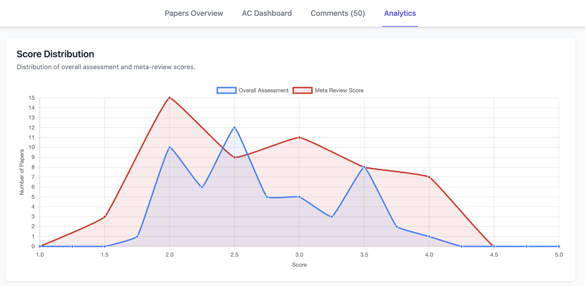
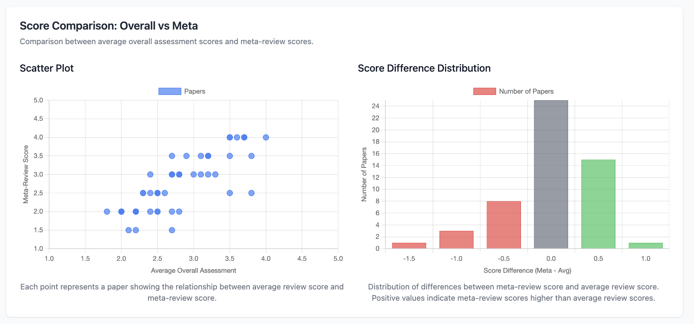
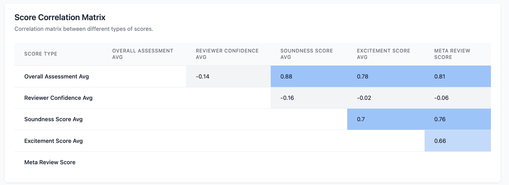
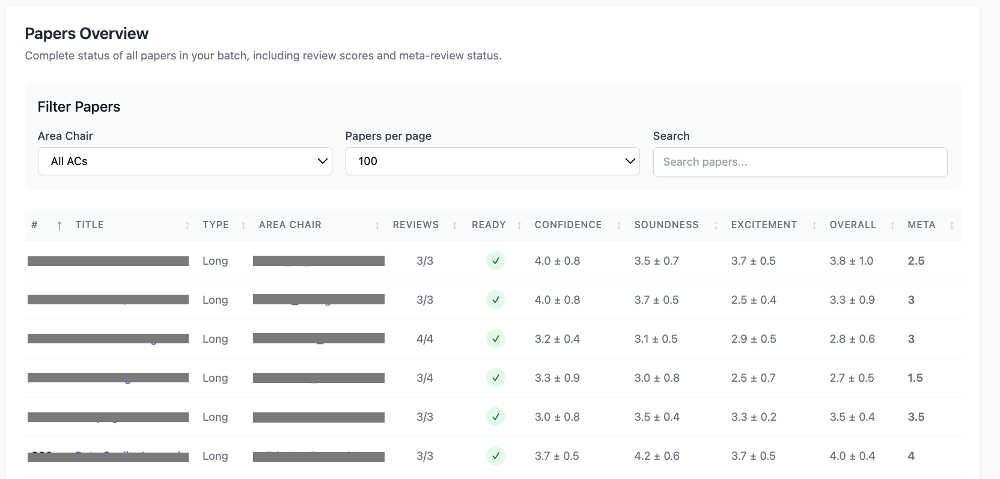
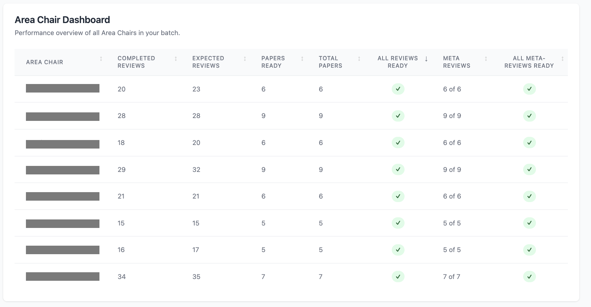
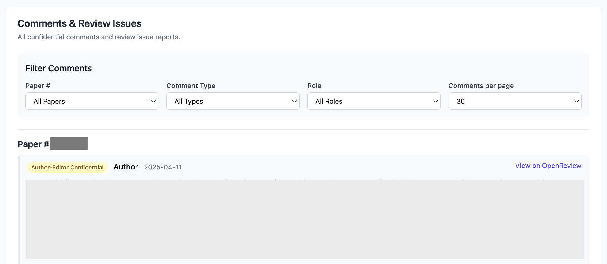

# ARR Report Generator

HTML dashboards for OpenReview ARR/ACL venues for Senior Area Chairs, Area Chairs, and Program Chairs. Covers both the **review phase** and the **commitment phase**.

**Runs entirely on your machine.** Your OpenReview credentials are only used to fetch data and are never stored or transmitted elsewhere.

📄 See [the doc page](https://mtreviso.github.io/arr-report-generator/docs.html) for a simple walkthrough, or use the README below for the full reference.

---

## Screenshots

|  |  |  |
|:---:|:---:|:---:|
|  |  |  |

---

## Installation

```bash
git clone https://github.com/mtreviso/arr-report-generator
cd arr-report-generator
pip install -r requirements.txt
```

Requires Python 3.9+.

---

## Usage

### Review Report (ARR venue)

```bash
python generate_review_report.py \
  --username your@email.com \
  --password yourpassword \
  --venue_id aclweb.org/ACL/ARR/2025/February \
  --me "~Your_Name1"
```

`--role sac` (default): only papers in your SAC batch.  
`--role pc`: all papers in the venue (PC/test mode, may take several minutes).

### PC Dashboard (ARR venue)

Fetches **all** papers across all SAC batches. Intended for Program Chairs. May take several minutes for large venues (6000+ papers).

```bash
python generate_pc_report.py \
  --username "your@email.com" \
  --password "yourpassword" \
  --venue_id "aclweb.org/ACL/ARR/2025/February" \
  --me "~Your_Name1"
```

### Commitment Report (ACL/EMNLP/etc. venue)

```bash
python generate_commitment_report.py \
  --username "your@email.com" \
  --password "yourpassword" \
  --venue_id "aclweb.org/ACL/2025/Conference" \
  --me "~Your_Name1" \
  --role sac
```

`--role sac` (default): papers where you are SAC.  
`--role ac`: papers where you are AC.  
`--role pc`: all papers.

### Credentials via environment variables

All three scripts read these env vars if flags are not supplied:

```bash
export OPENREVIEW_USERNAME="your@email.com"
export OPENREVIEW_PASSWORD="yourpassword"
export OPENREVIEW_ID="~Your_Name1"
python generate_review_report.py --venue_id aclweb.org/ACL/ARR/2025/February
```

## Comments levels

All report scripts support `--comments-level none|basic|full`.

- `none`: omit comments tab and skip comment processing
- `basic`: direct replies only 
- `full` (default): full reply threads --- slowest / largest output


### Output files

| Script | Output |
|--------|--------|
| `generate_review_report.py` | `reports/review_report.html` |
| `generate_pc_report.py` | `reports/pc_report.html` |
| `generate_commitment_report.py` | `reports/commitment_report.html` |

Open in any browser — fully self-contained, no server needed.

---

## Developer Cache (skip the slow fetch)

For iterating on templates locally, you can cache all OpenReview data to disk after one full run and reload it instantly on subsequent runs.

```bash
# Step 1: full fetch + save cache (do this once)
python generate_review_report.py ... --save-cache

# Step 2: use cache for all subsequent runs (seconds, not minutes)
python generate_review_report.py ... --use-cache
```

`--cache-dir .dev_cache` (default) controls where the pickle files go. You can maintain multiple named caches, e.g. one per SAC:

```bash
python generate_review_report.py ... --impersonate "~SAC_Name1" --save-cache --cache-dir .cache_sac1
python generate_review_report.py ... --use-cache --cache-dir .cache_sac1
```

The cache stores three files: `submissions.pkl`, `group_index.pkl`, and `processed.pkl`. It is **not** venue-aware — if you switch venues, use a different `--cache-dir` or delete the existing one.

> `--save-cache` and `--use-cache` are mutually exclusive.

## Impersonation (view as a SAC)

The review and commitment reports support impersonating another OpenReview user before fetching data. This requires **PC-level permission** on the venue and uses the [OpenReview impersonate API](https://docs.openreview.net/reference/api-v2/openapi-definition#post-impersonate).

```bash

python generate_review_report.py ... --me "~Target_SAC_Name1" --impersonate
python generate_commitment_report.py ... --me "~Target_SAC_Name1" --impersonate
```

You can pass a `GROUP_ID` after the `--impersonate` flag, which corresponds to the authorization group, e.g., `aclweb.org/ACL/ARR/2025/October/Program_Chairs`. If `GROUP_ID` is empty, it will assume to be `<venue_id>/Program_Chairs`. Your own credentials are used to authenticate, and all data is then fetched as the target user. 

This is useful for verifying exactly what a SAC sees without asking them to run the script themselves. Can be combined with `--save-cache` / `--use-cache` for fast iteration.

> Impersonation is intentionally not available in `generate_pc_report.py`, which already fetches all papers by design.


## Configuring the low-confidence threshold

The low-confidence flag triggers when any reviewer on a paper has a confidence score at or below the threshold. The default is **2**. To change it, edit the class variable near the top of `arr_report_generator.py`:

```python
class ARRReportGenerator:
    LOW_CONF_THRESHOLD = 2   # ← change this
```

---


## Credits

- Based on the ARR Tool by [Yiming Cui](https://ymcui.com/)

## License

MIT
